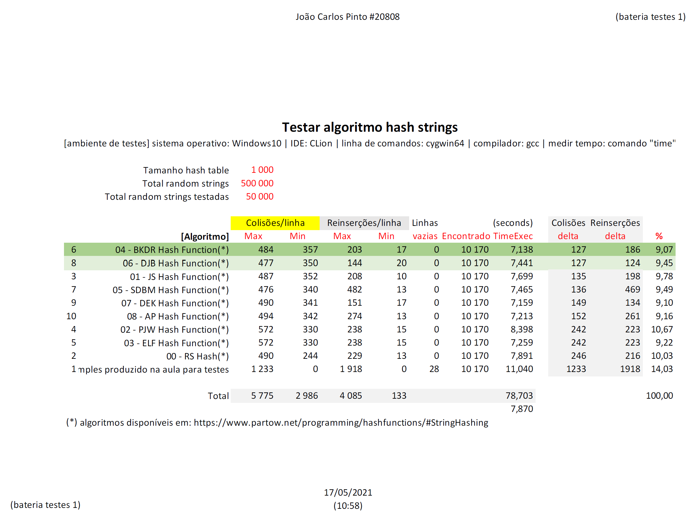

# algoritmos conhecidos hash | *hash known algorithms*
  
## Descrição | *Description*
 
É um exercício feito com o objetivo de testar diversas implementações de algoritmos conhecidas.
 
```
nesta pasta está apenas o código base utilizado e um módulo para testar o funcionamento da função de hash...
foi criado um makefile (o teste inicial foi feito em ambiente Windows e será compatível com ambiente Linux)
```
 
Cenário criado para o teste:
- tamanho da hashtable = 1000
- total de strings aleatórias geradas = 500000
- total de strings aleatórias testadas = 50000
 

[Resultado em formato PDF](hash_known_algorithms_bateria_testes_publicar.pdf)
 
 
- este trabalho de análise foi feito utilizando como ponto inicial a informação disponível nesta página: [https://www.partow.net/programming/hashfunctions/#StringHashing](https://www.partow.net/programming/hashfunctions/#StringHashing)
 
***
   
*It is an exercise done in order to test several known algorithm implementations.*

```
*in this folder is only the base code used and a module to test the function of hash...
a Makefile has been created (the initial test was done on Windows environment and will be compatible with Linux environment)*
``` 
 
*Scenario created for the test:
- hashtable size = 1000
- total generated random strings = 500000
- total random strings tested = 50000*
 

[Result in PDF format](hash_known_algorithms_bateria_testes_publicar.pdf) 
  
- this analysis work was done using as a starting point the information available on this page: [https://www.partow.net/programming/hashfunctions/#StringHashing](https://www.partow.net/programming/hashfunctions/#StringHashing) 
 
 
## Licença | *License*
 
Copyright (c) 2021, João Carlos Pinto 
  
[BSD-3-Clause License](LICENSE.md) 
 